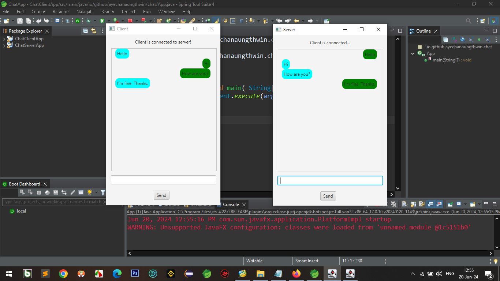

# How to test

- Two Maven project acting as JFX project. You don't need to configure the project. Just clone it and then run the server app. After that, run the client app. Now, you can message to each other.

