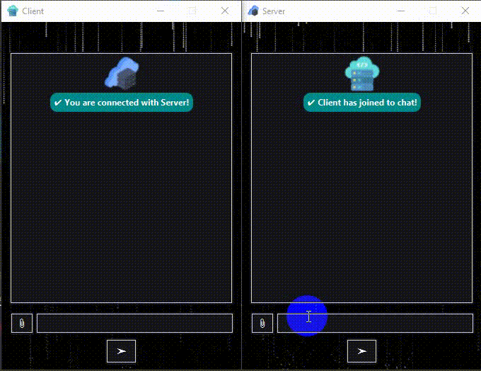

# ChatApp (JFX)
## Abstract
> This is the test purpose JFX project that can directly runs as "Java Application" on Maven project.
> So, you need to set configuration if you wanna run it as JFX.

## How it looks like


## About
- [X] Sockets in Java (Server/Client)
- [X] Multi-threading in Java (Standalone/ThreadPool)
- [X] Project Lombok (For boilerplate codes.)
- [X] Jackson (To convert object to json and vice versa.)
- [X] Encrypt/Decrypt String (Using Apache Commons Crypto library.)
- [X] Chain of responsibility (Refactored with COR design pattern.)

## Concerning your CPU Performance
```
	@FXML
    	private Label status;

	public ServerController() {
		new Thread(() -> {
			try {
				server = new Server(7777); 
				Thread.sleep(300); 
				//Codes
			} catch (Exception e) {
				//Codes
			}
		}).start();
	}
```
- Both ServerController and ClientController class, there is a ```Thread```. Since this ```Thread``` runs concurrenty with the construction of the constructor, if status is called before the status field has been initialized, a ```NullPointerException``` may occur. So you can wait with the sleep thread until the initialization is done. This is also related to the performance of your CPU, so consider increasing the sleep time from 1000 to 3000ms when necessary.

## Electronics Engineer-cum-J2EE Backend Developer ##
-  Created by - Aye Chan Aung Thwin