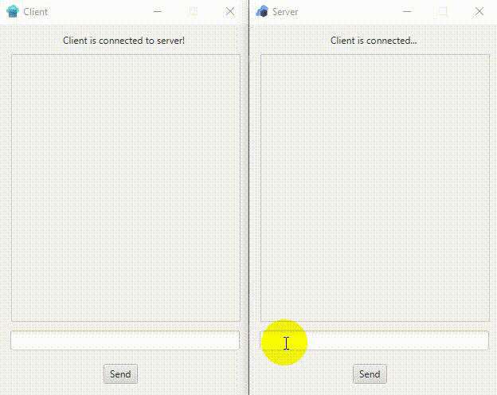

# ChatApp (JavaFX)

A real-time chat application built with JavaFX featuring client-server architecture with encrypted messaging.

## Preview



## Features

- **Real-time Messaging**: Instant communication between server and client
- **Encrypted Communication**: Messages encrypted using Apache Commons Crypto
- **File Sharing**: Send PNG/JPG/JPEG images between users
- **Typing Indicators**: Visual feedback when users are typing
- **Profile Images**: Support for user profile pictures
- **Dark Theme UI**: Modern dark interface with custom styling

## Architecture

- **Client-Server Model**: Socket-based communication on port 7777
- **Chain of Responsibility Pattern**: Handles different message types (text, images, typing status)
- **Multi-threading**: Concurrent handling of incoming/outgoing messages
- **JSON Serialization**: Jackson library for object serialization

## Tech Stack

- Java 11+
- JavaFX 21/22 (UI framework)
- Maven (build tool)
- Project Lombok (boilerplate reduction)
- Jackson (JSON processing)
- Apache Commons Crypto (encryption)
- Commons IO (file utilities)

## Project Structure

```
ChatApp/
├── ChatClientApp/          # Client-side application
│   └── src/main/java/
│       └── io/github/ayechanaungthwin/chat/
│           ├── controller/  # FXML controllers
│           ├── cor/         # Chain of Responsibility handlers
│           ├── jfx/         # JavaFX startup utilities
│           ├── model/       # Data models (DTO, Client, Socket)
│           ├── ui/          # UI utilities
│           └── utils/       # Encryption, file, image utilities
└── ChatServerApp/          # Server-side application
    └── src/main/java/
        └── io/github/ayechanaungthwin/chat/
            ├── controller/  # Server controller
            ├── cor/         # Chain of Responsibility handlers
            ├── jfx/         # JavaFX startup utilities
            ├── model/       # Data models (DTO, Server, Socket)
            └── utils/       # Shared utilities
```

## Prerequisites

- Java 11 or higher
- Maven 3.6+
- JavaFX SDK (if not using Maven)

## Installation & Running

### Clone the repository

```bash
git clone https://github.com/AyeChanAungThwin/ChatApp
cd ChatApp
```

### Run the Server

```bash
cd ChatServerApp
mvn clean javafx:run
```

### Run the Client

```bash
cd ChatClientApp
mvn clean javafx:run
```

### Manual Setup (Alternative)

1. Build with Maven: `mvn clean package`
2. Run the JAR files directly

## Configuration Notes

### Thread Sleep Timing

Both `ServerController` and `ClientController` use a sleep thread to handle concurrent initialization:

```java
new Thread(() -> {
    try {
        server = new Server(7777);
        Thread.sleep(300); // Adjust based on CPU performance
        // ...
    } catch (Exception e) {
        // ...
    }
}).start();
```

If you experience `NullPointerException` errors, increase the sleep time from 300ms to 1000-3000ms depending on your system performance.

### Port Configuration

Default server port: **7777**

To change the port, modify the `Server` constructor call in `ServerController.java`.

## Design Patterns Used

- **Chain of Responsibility**: Message handling pipeline
- **Singleton**: Utility classes
- **MVC**: Separation of concerns (Model-View-Controller)
- **Observer**: Socket event handling

## License

MIT License - see [LICENSE](LICENSE) file for details.

## Author

**Aye Chan Aung Thwin**
Electronics Engineer-cum-J2EE Backend Developer

## Acknowledgments

- OpenJFX team for JavaFX libraries
- Jackson project for JSON processing
- Apache Commons for Crypto library
